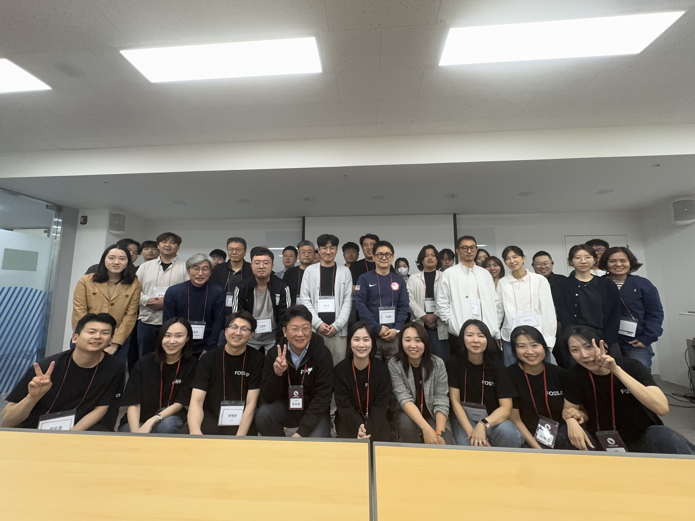
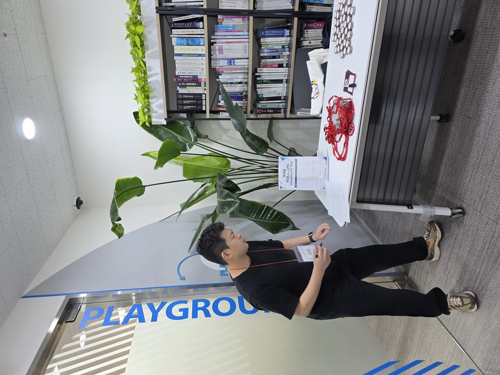
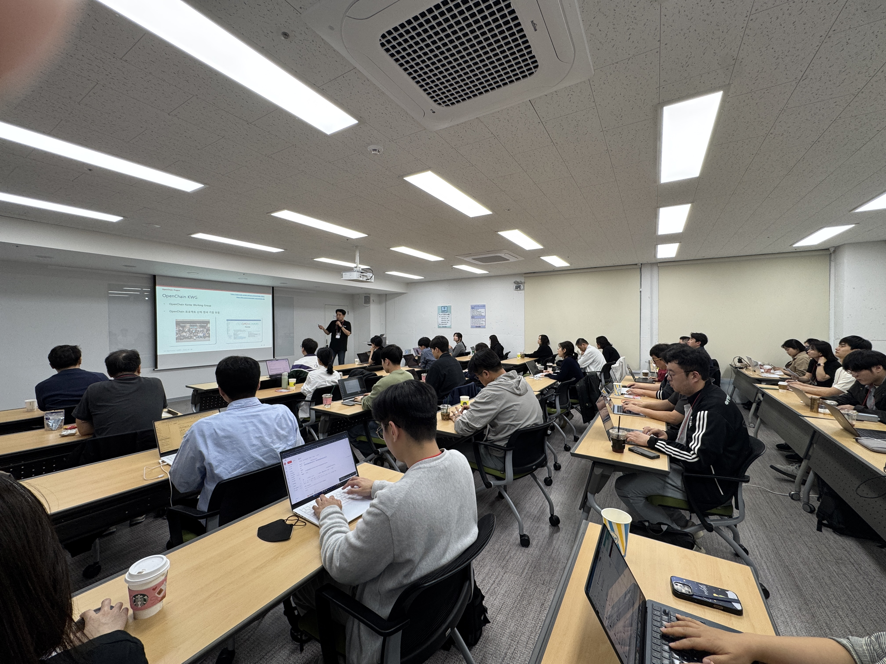
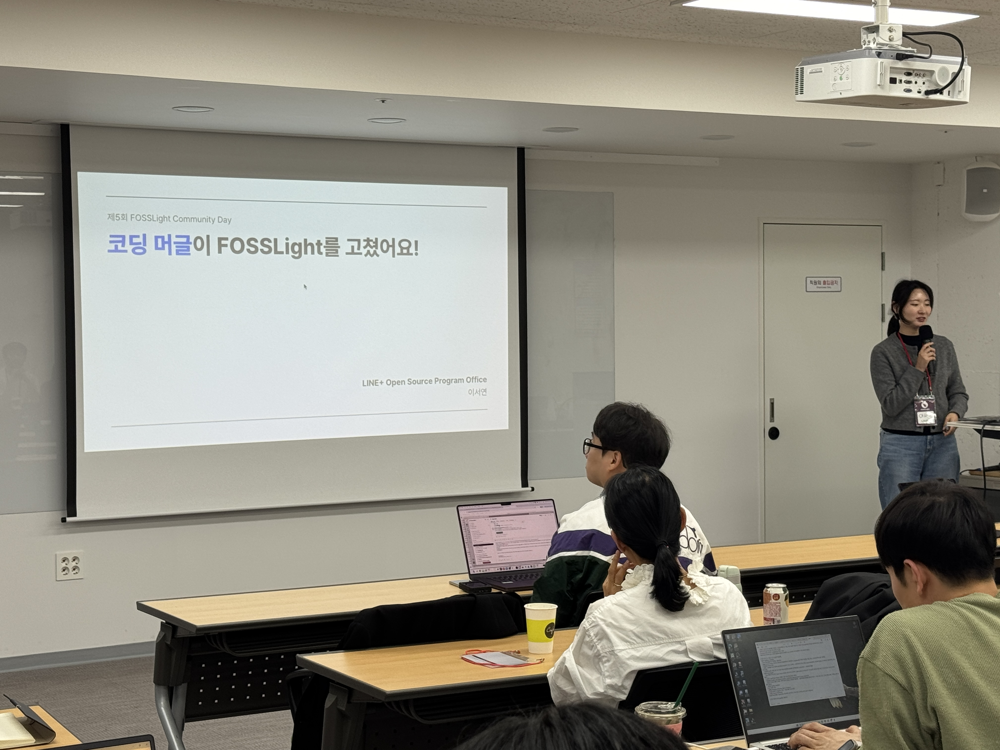
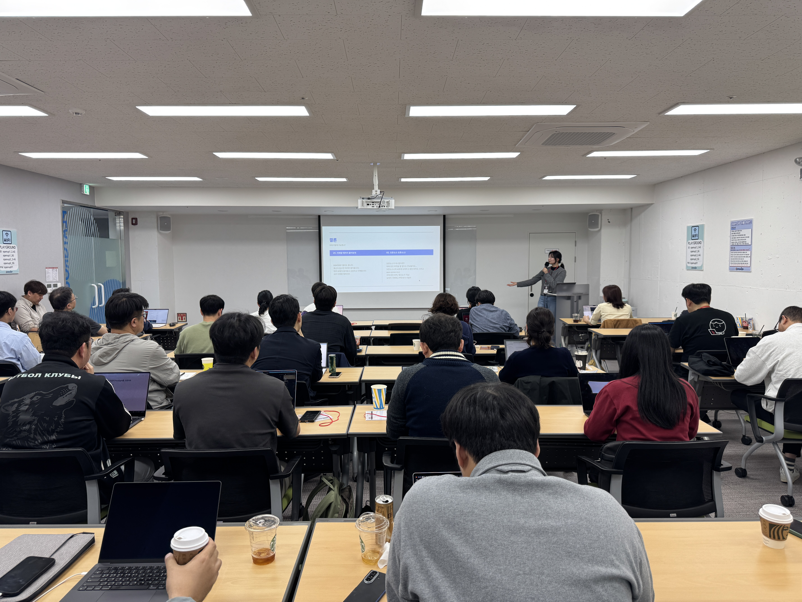
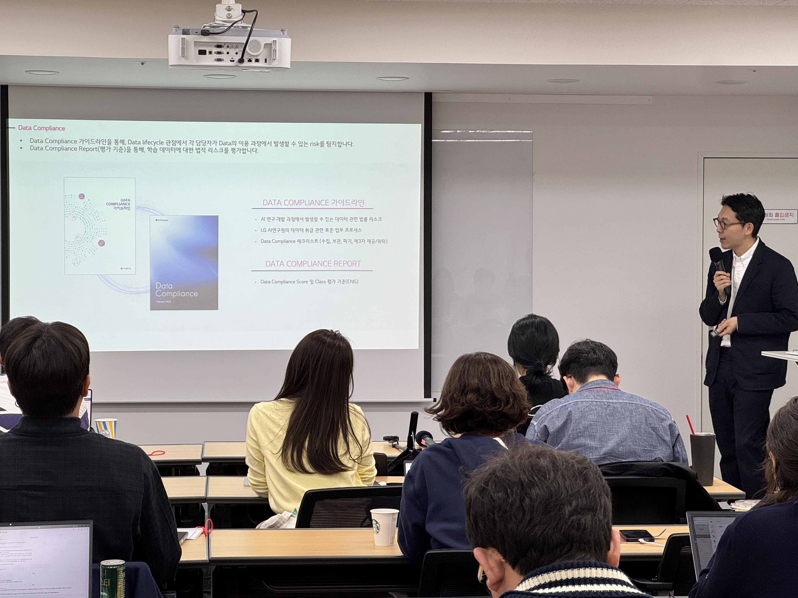
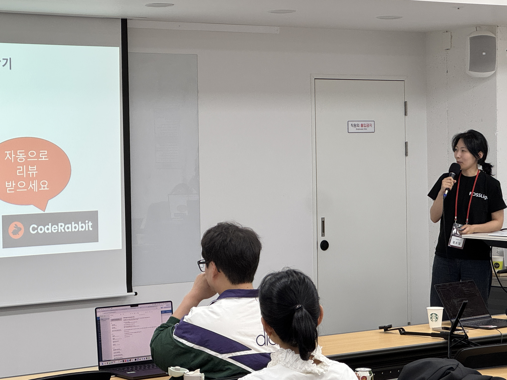
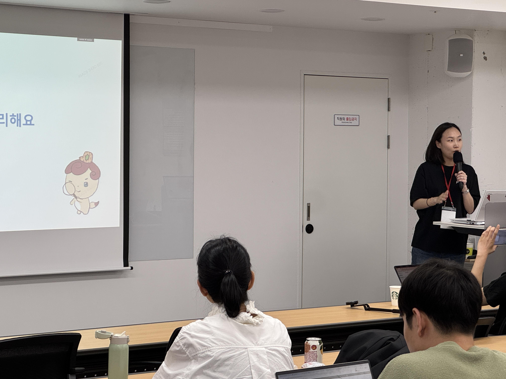
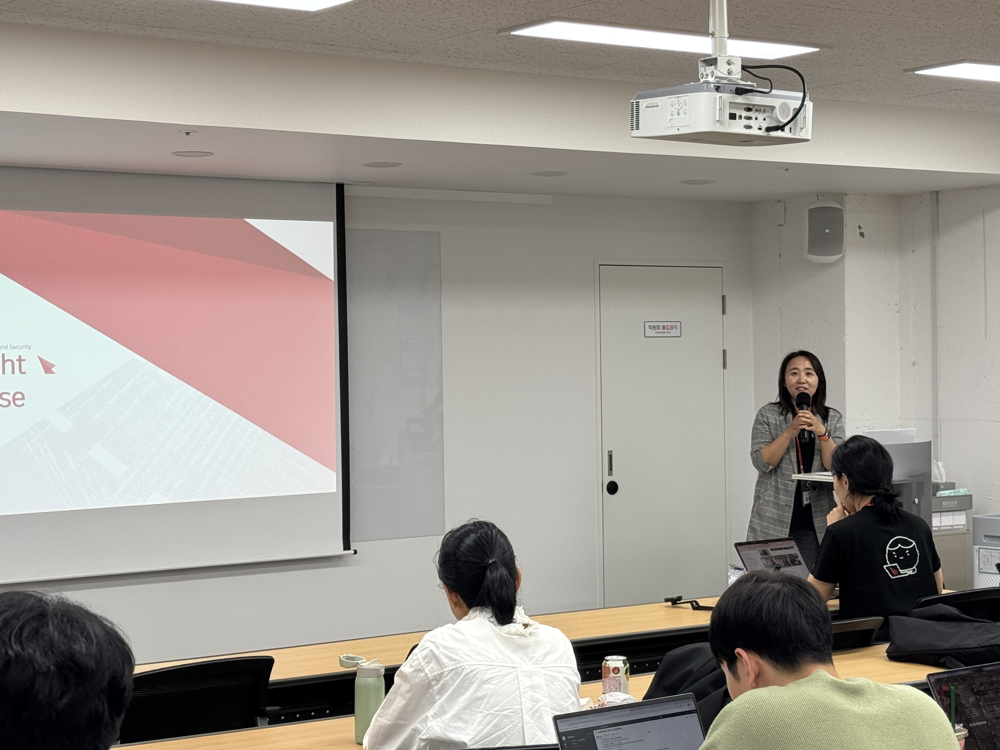

# 제 5회 FOSSLight Community Day 개최
2026년 04월 28일, 제5회 FOSSLight Community Day가 성공적으로 개최되었습니다. 이번 행사에는 20여 개 기업의 담당자들이 참석하여 FOSSLight의 최신 기능과 다양한 활용 사례를 공유하고, 실무 적용 방안에 대해 심도 있는 논의를 진행했습니다.
 
오전 세션은 FOSSLight 및 사용 가이드에 대해 전반적인 소개로 구성되었습니다. 참가자들이 FOSSLight의 역사 및 구조, 실무 적용 포인트를 이해할 수 있는 시간이었습니다.
 
오후 세션에서는 요즘 오픈 소스 세상이 어떻게 흘러가고 있는지를 간단히 들을 수 있었고, 라인플러스의 이서연님의 FOSSLight를 도입하고, 코딩 머글들이 좌충우돌 업데이트해나가는 과정을 재미있게 말씀해주셨습니다.
 
그리고, 근래 매우 핫한 주제인 생성형 AI 학습데이터 분쟁과 AI-BOM 기반 투명성 컴플라이언스 관련 주제로 LG AI연구원의 변호사이신 조정원님의 발표가 있었습니다. 
 
마지막으로, FOSSLight Scanner와 Hub의 CI/CD 연동 사례, 보안 취약점 관리에 대한 소개가 진행되어 많은 관심을 받았습니다.
  
이번 FOSSLight Community Day는 단순한 기능 소개를 넘어 실무 도입 사례, AI 학습데이터 분쟁 등 폭넓은 정보를 제공하는 유익한 자리였습니다. 행사 자료와 발표 슬라이드는 아래 발표 자료 목록에서 확인하실 수 있습니다. 

# 발표 자료
       
- [FOSSLight 소개 및 사용 가이드 - 민경선(LG전자)](../../assets/files/260428/260428_FL_Day_FOSSLight소개_민경선.pdf)
- [요즘 오픈 소스 세상 - 박원재(LG전자)](../../assets/files/260428/260428_FL_Day_요즘오픈소스세상소식_박원재.pdf)
- [코딩 머글이 FOSSLight를 고쳤어요! - 이서연(라인플러스)](../../assets/files/260428/260428_FL_Day_코딩머글이FOSSLight를고쳤어요_이서연.pdf)
- [생성형 AI 학습데이터 분쟁과 AI-BOM기반 투명성 컴플라이언스 - 조정원(LG AI연구원)](../../assets/files/260428_FL_Day_생성형AI학습데이터분쟁과AIBOM기반투명성컴플라이언스_조정원.pdf)
- [FOSSLight Scanner + Hub CI/CD 연동 활용 사례 - 김소임(LG전자)](../../assets/files/260428/260428_FL_Day_FOSSLight_Scanner_Hub_연동사례_김소임.pdf)
- [FFOSSLight Hub의 보안취약점 관리 - 석지영(LG전자)](../../assets/files/260428/260428_FL_Day_FOSSLightHub의보안취약점관리_석지영.pdf)
- [FOSSLight Hub 오픈소스 vs 엔터프라이즈- 김경애(LG전자)](../../assets/files/260428/260428_FL_Day_오픈소스대Enterprise_김경애.pdf)
       

### 장소 후원 : Nipa 정보통신산업진흥원    

### 사진
 
 
 
 
 
 
 
 
 
 
 
 

