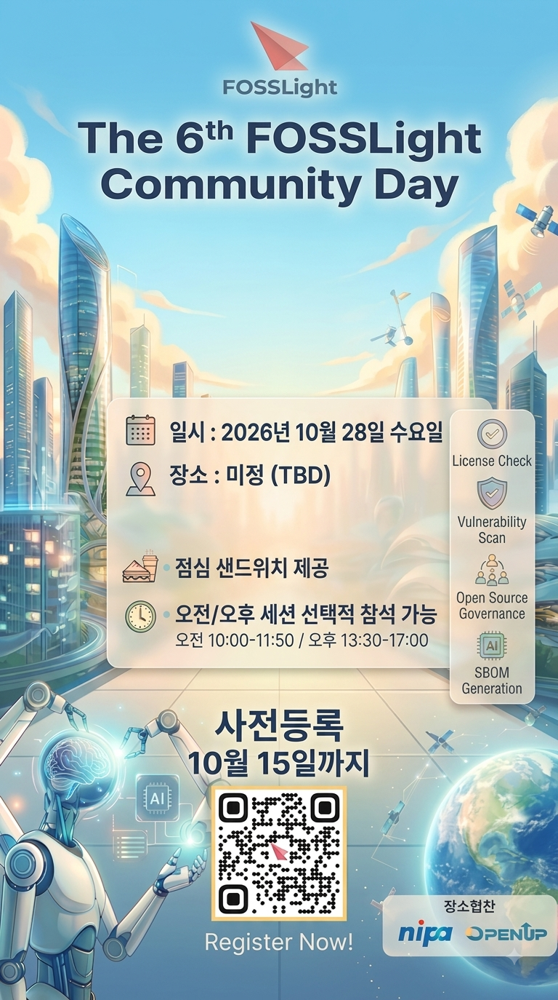

## 제6회 FOSSLight Community Day 예고
 - 일시 : 2026.10.28 수요일
 - 장소 : 미정 
 - 점심 : 제공 
 - 오전/오후 세션 선택적 참석 가능
 
### 사전 등록 링크
10/15까지 사전등록 가능합니다. 사전 등록하시어 참가 선물과 점심 샌드위치 신청하세요🎁.       
<a href="https://forms.gle/DM2dnKJanE2yVbBH9" target="_blank">사전 등록 바로가기 (클릭)</a>

### FAQ 질문 등록 링크
10/20까지 이번 행사에서 듣고 싶은 내용이나 질문이 있다면, 아래 링크를 통해 등록해주세요. 행사 당일 FAQ세션을 통해 답변해드리겠습니다.   
<a href="https://forms.gle/KjuSSSTxinjVjLJk7" target="_blank">사전 질문 등록하기 (클릭)</a>

### Agenda
* agenda는 변경 될 수 있으니, 양해 부탁드리겠습니다.

|Time|제목|
|--- | --- |
|09:50 ~ 10:00|행사 등록| 
|10:00 ~ 10:40|누구나 따라할 수 있는 FOSSLight Scanner(시연)| 
|10:40 ~ 11:00|Coffee Break|
|11:00 ~ 12:00|누구나 따라할 수 있는 FOSSLight Hub(시연)| 
|12:00 ~ 13:00|점심 시간| 
|13:00 ~ 13:20|FOSSLight Scanner 또 Update 되었어요| 
|13:20 ~ 13:40|예쁘고 쉬운 UI를 입힌 FOSSLight Scanner| 
|13:40 ~ 14:10|변화하는 SBOM 규제와 트랜드| 
|14:10 ~ 14:25|Coffee Break| 
|14:25 ~ 15:05|FOSSLight Hub의 강화된 보안 취약점 검출 능력|
|15:05 ~ 15:35|FOSSLight 사용자 경험을 공유합니다|
|15:35 ~ 15:50|Coffee Break|
|15:50 ~ 16:10|무엇이든 물어보세요, FOSSLight Scanner 편|
|16:10 ~ 16:30|무엇이든 물어보세요, FOSSLight Hub 편|
|16:30 ~ 17:00|FOSSLight Enterprise 를 경험해보세요|

### 장소 후원 : Nipa 정보통신산업진흥원, OpenUp 

